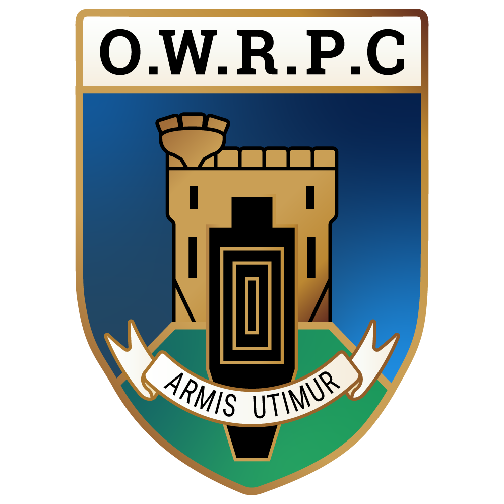
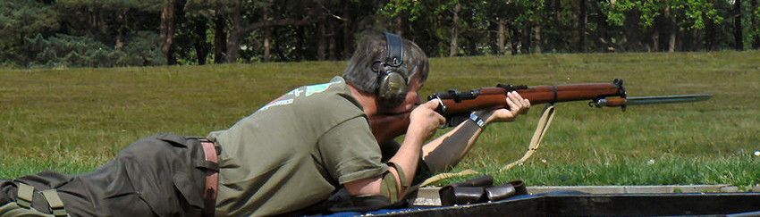

<!-- Main Page Content -->

<h1 class="display-4 text-center">Old Windsor Rifle & Pistol Club</h1>

Private members target rifle club since 1977

Welcome to Old Windsor Rifle & Pistol Club. If you live in the area and are interested in any form of target shooting then you have come to the right place. Have a look around and get in touch if you’d like to join us.

Target shooting is a long-established sport which can be enjoyed by people of all ages and physical ability. Some shooters are highly competitive while others participate for fun and relaxation. There is a wide range of disciplines to suit all interests and budgets, and shooting has one of the best safety records of any sport.
